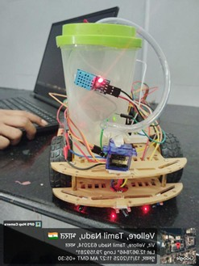
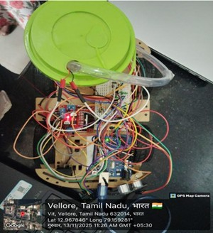
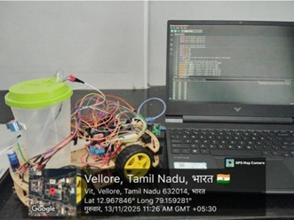
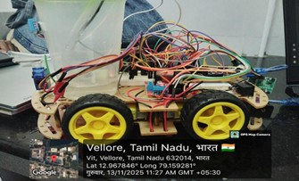

Autonomous Fire-Fighting Robot:
A low-cost embedded robotic system designed to autonomously detect, navigate, and suppress fire in hazardous environments, reducing human risk and intervention. Built on Arduino technology, the robot integrates sensors, actuators, and intelligent control algorithms to operate effectively in real-time scenarios.

Overview:
This project demonstrates the design and development of an Arduino-based autonomous fire-fighting robot. The robot can detect flames, avoid obstacles, and extinguish fires efficiently using a water pump and servo-controlled nozzle. It combines embedded systems, robotics, and automation to deliver a compact, scalable, and educational prototype for safety applications.# AUTONOMOUS_FIRE_FIGHTING_ROBOT
Arduino‑based autonomous robot detects fires, navigates obstacles, and extinguishes flames using sensors, embedded control, and real‑time suppression.

Objectives:
Detect fire using flame sensors with high accuracy.
Navigate autonomously in environments filled with obstacles.
Extinguish fire using a servo‑controlled water spray mechanism.
Reduce human exposure to hazardous conditions.
Build a cost‑effective, replicable, and scalable solution for education and industry.

Core Concepts:
Embedded Systems & Microcontroller Programming
Sensor Interfacing (flame, ultrasonic)
Autonomous Navigation & Obstacle Avoidance
Real-Time Processing & Decision Making
Actuator Control (motors, pump, servo)
Robotics & Automation Principles

Hardware Components:
Arduino Uno – Microcontroller, the brain of the system.
Flame Sensor – Detects fire presence.
Ultrasonic Sensor (HC-SR04) – Detects obstacles.
L298N Motor Driver – Controls DC motors.
DC Motors & Wheels – Provide mobility.
Servo Motor – Directs water spray.
Water Pump – Fire suppression mechanism.
Battery (7.4V–12V) – Portable power supply.

Software Implementation:
Language: C/C++ (Arduino IDE)

Modules:
Sensor Initialization – Configure flame and ultrasonic sensors.
Navigation Logic – Move forward, avoid obstacles.
Fire Detection – Continuously monitor flame sensor input.
Fire Suppression – Stop, align servo, activate pump.
System Loop – Repeat detection, navigation, and suppression.

Working Principle:
Robot scans surroundings continuously.
Detects obstacles and navigates safely.
Identifies fire using flame sensor thresholds.
Stops and positions toward fire.
Activates pump and sweeps nozzle to extinguish flames.
Resumes movement after suppression.

Project Images:

Documentation:

 [Project Report](docs/Fire_Fighting_Robot_Report_github.pdf)

Results & Performance:
Fire Detection Accuracy: ~90%
Response Time: < 3 seconds
Obstacle Avoidance: Successful in random setups
Battery Backup: ~30–40 minutes

Testing Environment:
Indoor lab setup with controlled flame sources (candles, burners).
Randomly placed obstacles for navigation testing.
Safe, repeatable conditions for performance evaluation.

Applications:
Industrial fire safety systems
Smart homes and buildings
Hazardous labs and factories
Defense and surveillance robots
Agricultural storage safety

Future Scope:
AI‑based fire detection using cameras + ML.
IoT‑enabled remote monitoring and alerts.
LiDAR‑based advanced navigation.
Swarm robotics for multi‑robot firefighting.
Improved energy efficiency and longer battery life.

Skills Gained:
Embedded Systems Development
Arduino Programming & Debugging
Sensor Integration & Calibration
Robotics Design & Automation
Problem Solving in Real-Time Systems
System Design Thinking & Documentation

Team
V VAISHNAVI  
Institution: Vellore Institute of Technology (VIT)

*Support*
If you found this project inspiring, consider giving it a star on GitHub to support further development and encourage open-source innovation.
